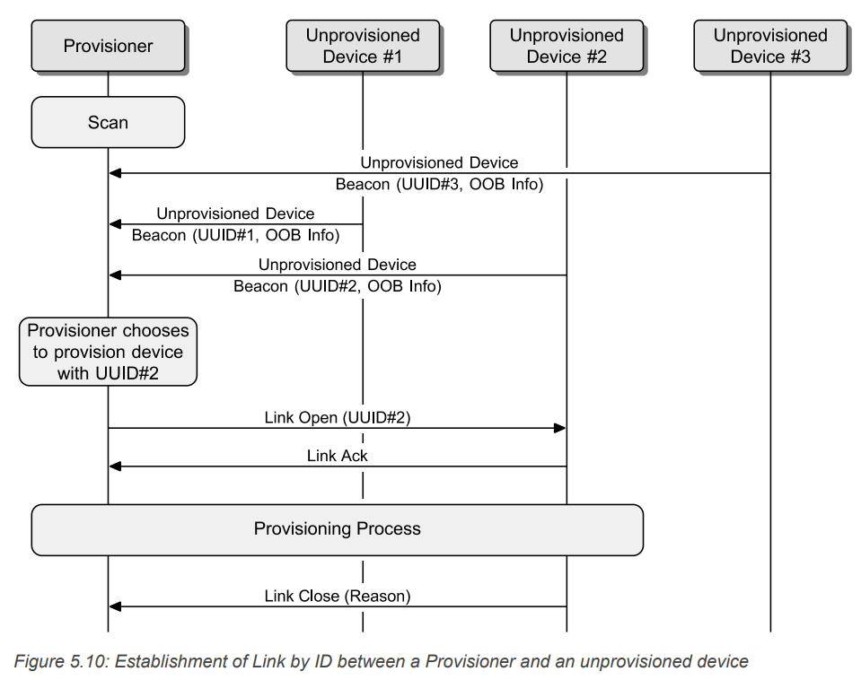
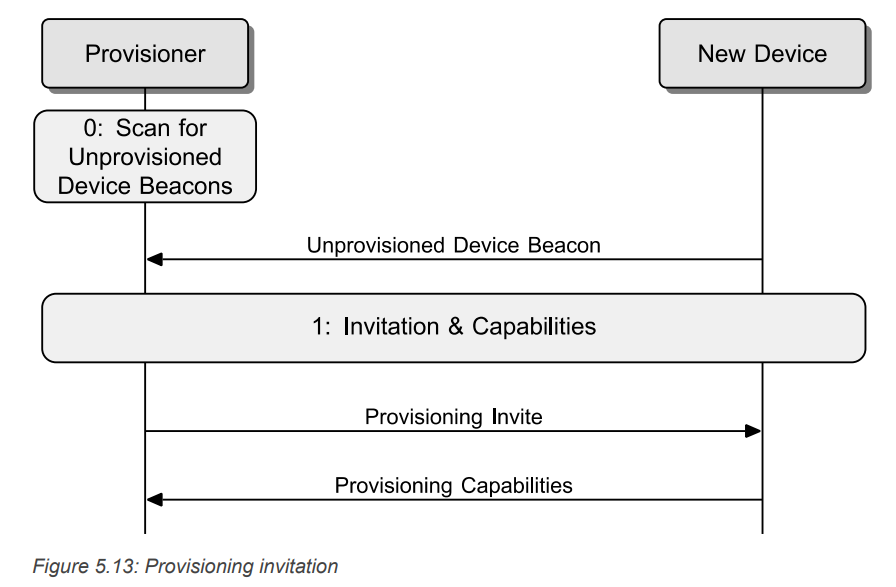
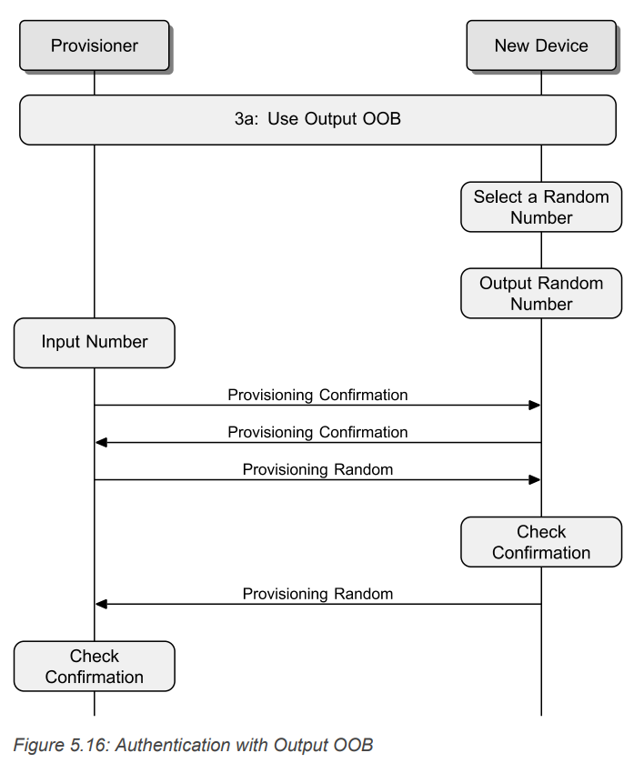
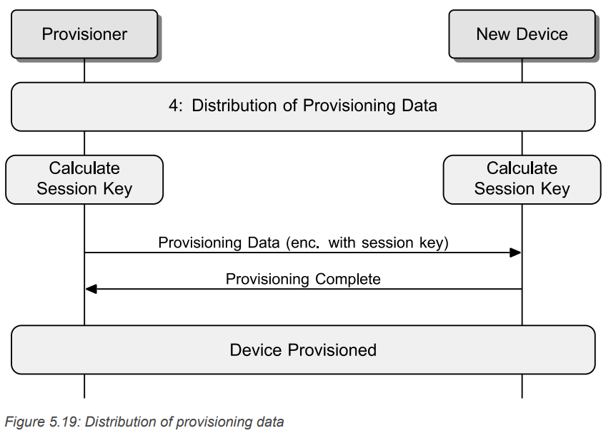

# cmpt789-assignment3

In Assignment 2, you have implemented an attack that passively sniff BLE traffic and break the encryption by exploiting a weakness in this protocol.

In this assignment, you will implement another key-sharing protocol in Bluetooth, the provisioning protocol in Bluetooth Mesh.
This protocol is used when adding a new device to an existing Mesh network.
For example, you bought a light supporting Bluetooth Mesh and you want to add it to your existing Mesh network.
The devices within the same Mesh network share the same **Network Key**, and if they run the same application, they share the same **Application Key**.
In order to distribute these keys to the newly-bought light, you will use your phone as the **provisioner** to send these keys to the light, which is the **device**.

Similar to the one in Assignment 2, this protocol also contains a vulnerability that allows an active attacker to decrypt the ciphertext and get the secret key.
After finishing implementing the protocol, you will also need to implement the attack.

To make it easy to implement and debug, the current provisioning process is implemented on top of TCP rather than Bluetooth.

There are five files (excluding this one) in this repo, *device.py*, *provisioner.py*, *attacker.py*, *toolbox.py*, and *requirements.txt*.

The *device.py* implements the provisioning logic on the Mesh device (light) side while the *provisioner.py* implements the provisioning logic on the provisioner device (smartphone) side.

*toolbox.py* contains shared cryptographic and helper functions as well as pre-defined values.

*attacker.py* will be explained later.

The provisioning process starts from the device sending out a *Unprovisioned Device beacon* to the provisioner device, which is already implemented in the *device.py* file.
Your overall goal is to implement the provisioning protocol and then implement an active attack against this provisioning process.
Note that, the whole provisioning process includes the unprovisioned device beacon, link open, provisioning, and link close, as shown in the following figure.



To implement the provisioning process, you may need to read the Bluetooth Mesh specification to understand how it works.
The process is described in [5.4.2 Provisioning behavior](https://www.bluetooth.org/docman/handlers/downloaddoc.ashx?doc_id=457092).

**You only need to implement the provisioning process for no OOB public key and Output OOB authentication.**

After you've finished the implementation, it's helpful to test your code with [8. Sample data](https://www.bluetooth.org/docman/handlers/downloaddoc.ashx?doc_id=457092) to check if your implementation is correct or not.


## Task 0: Environment setup

This project is implemented in python3. The code is tested with python 3.12.3. You may use other versions of python as long as it's compatible with the two dependencies in *requiremnts.txt*.

You can use the following command to install the dependencies:
```
pip pwntools==4.13.0 pycryptodome==3.20.0
```

It's recommended to use a [virtual environment](https://docs.python.org/3/library/venv.html) for this project.
You can also use [virtualenvwrapper](https://virtualenvwrapper.readthedocs.io/en/latest/) to help manage the virual environments.

## Task 1: Implement the provisioning in Bluetooth Mesh (40 points)

The Output OOB authentication is used when the device has output capabilities (e.g., screen).
(The provisioner is usually a high-end device with both input and output capabilities.)
When constructing the *provisioning capabilities* message, please the values provided in *device.py*.


Besides beacon, there are also 4 phases in provisioning:


### Phase 1: Invitation (5.4.2.2 in the spec)

The provisioner sends a *Provisioning Invite* to the device, and the device responds with a *Provisioning Capabilities*, as shown in the following figure.



### Phase 2: Exchanging Public Keys (5.4.2.3 in the spec)

In this phase, the two devices exchange their public keys and derive the DHKey, as shown in the following figure:


### Phase 3: Authentication (5.4.2.4 in the spec)

In this phase, the *device* will display a **string** on the screen and the user needs to input this string to the *provisioner*.
Note that **do not** display a number like shown in the figure.
Instead, use the *output_oob_action* defined in device.py to dispaly a string that may contain numbers, upper/lower letters.

The overall steps in this phase are as follows:



### Phase 4: Distribution of Provisioning Data (5.4.2.5 in the spec)

Use the values defined in provisioner.py as the data to distribute:
```
NetworkKey = b'\xff\xee\xdd\xcc\xbb\xaa\x99\x88\x77\x66\x55\x44\x33\x22\x11\x00'
KeyIndex = b'\x00\x00'
Flags = b'\x00'
IVIndex = b'\x11\x22\x33\x44'
UnicastAddress = b'\xaa\xbb'
```

The overall steps are as follows:



## Task 2: Implementation the active attack against this provisioning process (40 points)

There is a significant weakness within this provisioning method.

Assume the attacker is able to sniff all data exchanged between the device and the provisioner, as implemented in the *sniff()* function in *attacker.py*.
The attacker is also able to modify any data exchanged between the device and the provisioner, via the *fake_prov()* and *fake_dev()* functions.

Finish *fake_prov()* and *fake_dev()* functions to launch the attack against this provisioning method.

The goal of this attack is to obtain the data listed in Phase 4 in plaintext.

## Task 3: Write a report (20 points)

Write a report explaining the following points:

- How each of the provisioning phases are implemented in your code? (5 points)

- What is the weakness in this provisioning method and how to exploit it? (15 points)

You can also include other topics you think are important for this project.

## Bonus: Other weaknesses (50 points)

If you can identify other weaknesses in this protocol, discuss them in the report and try to implement attacks exploiting these weaknesses.

## Submit Instruction

Please make sure your code can run.

- For Task 1, please use *65432* as the port number for both the device and the provisioner, so that they can finish the provisioning process.

- For Task 2, please use *65432* and *65433* two port numbers, the same as the current setting, to demonstrate the attack.
Your code will be tested by first running *provisioner.py*, then *attacker.py*, and lastly *device.py*.

- For bonus, use the same setting as Task 2.

**Please create one folder for each Task/bonus containing the corresponding code.**

Lastly, please put all your code and report under one folder (e.g., 'proj3') and compress the folder (e.g., using `tar czvf proj3.tgz proj3').

Upload your code in Canvas.